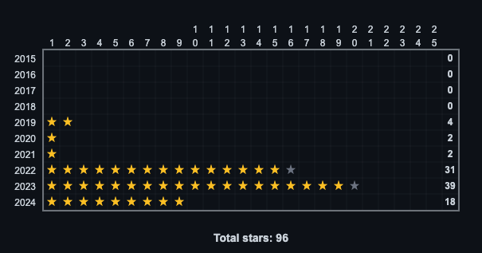
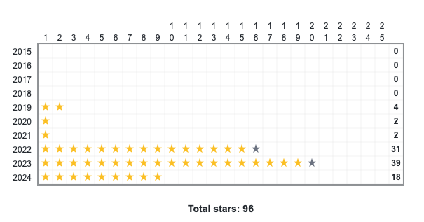

# Advent of Code stars

Generate Advent of Code star graph for years, to show progress throughout the years.

The SVG supports light/dark mode.

## API

The project is deployed as an API, where you can make a request with the path
to a .txt file in your GitHub repo, which will return a SVG representation of
it.

For example, assuming you have the user `<user>` with the repo `<repo>` which
has the file `src/stars.txt` in the `main` branch, you can make a request to

```
https://aoc-stars.fly.dev/stars/<user>/<repo>/main/src/stars.svg
```

Note the `.svg` ending instead of `.txt`.

This can be embedded directly in a GitHub readme, like this one for my main Advent of Code readme:

```html
<div align="center">
    
</div>
```

which will look like this:

<div align="center">
    
</div>

## CLI tool

You can also generate the SVG locally with the cli tool,

```
❯ ./cli --help
CLI tool to generate SVG visualizations from Advent of Code stars data

Usage: cli [OPTIONS] <INPUT>

Arguments:
  <INPUT>
          Input file containing advent calendar data

          Input file should be a text file with a list of years and the 25 days
          for that year. The list of days should be 0, 1 or 2 where 0 is no
          stars, 1 is just part 1 and 2 means part 2 has been solved.

          Example:

          2024: 2,2,2,2,2,2,2,0,0,0,0,0,0,0,0,0,0,0,0,0,0,0,0,0,0

Options:
  -o, --output <OUTPUT>
          Optional path for the output SVG file

  -h, --help
          Print help (see a summary with '-h')

  -V, --version
          Print version 
```

## Input file

The file should be a well formatted text file in the following structure:

1. Each line starts with the year, followed by a colon
2. The rest of the line should contain 25 comma separated integers
    i. 0 means day not solved
    ii. 1 means part 1 has been solved
    iii. 2 means part 2 has been solved

For example:

```
2018: 2,2,2,2,2,2,2,2,2,2,1,1,1,1,1,1,1,2,2,2,2,2,2,2,1
2019: 2,2,0,0,0,0,0,0,0,0,0,0,0,0,0,0,0,0,0,0,0,0,0,0,0
2023: 2,2,2,2,2,2,2,2,2,2,2,2,2,2,2,2,2,2,2,1,0,0,0,0,0
2024: 2,2,2,2,2,2,2,0,0,0,0,0,0,0,0,0,0,0,0,0,0,0,0,0,0
```

generates

<div align="center">
    
</div>

## Examples

### Dark mode
<div align="center">
    
</div>

### Light mode
<div align="center">
    
</div>
